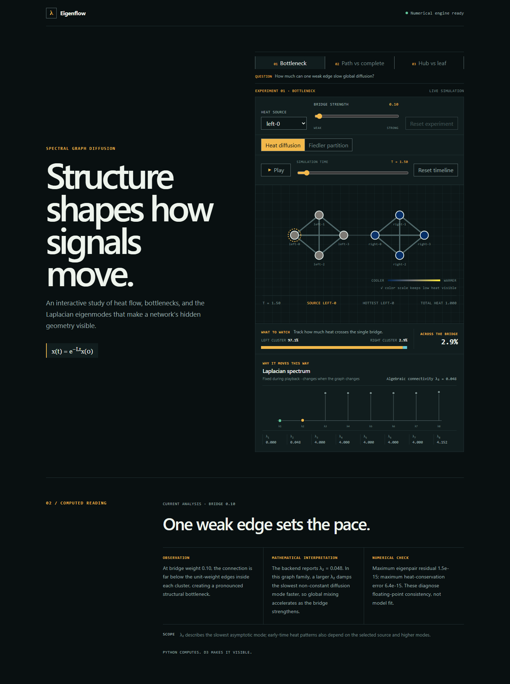
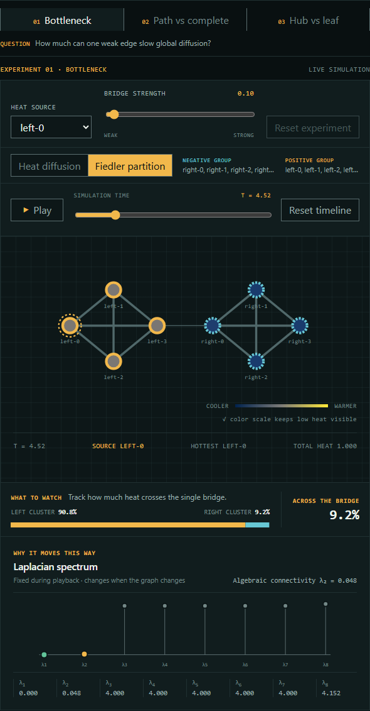

# Eigenflow

[](https://github.com/sebasalonsogp/eigenflow/actions/workflows/ci.yml)

**One weak edge sets the pace for an entire network.** Eigenflow is an interactive
spectral-diffusion study that turns the graph Laplacian into something visible and
testable: change a bridge, inject heat, and watch the spectrum explain what moves.

[Watch the interaction](docs/media/eigenflow-demo.webm) ·
[Read the mathematics](docs/math-model.md) ·
[Inspect the architecture](docs/architecture.md)

[](docs/media/eigenflow-demo.webm)

At the default bridge weight of `0.10`, heat spreads through the source community
while the other remains cool. The same analysis reports `λ₂ = 0.048`: a small
algebraic connectivity that identifies the slow global mode. Strengthen the bridge
and both the spectral gap and cross-community mixing increase.

## What you can explore

The main experiment is deliberately simple enough to understand in seconds:

1. Choose where heat enters the graph.
2. Play or scrub diffusion through time.
3. Change the single bridge joining two dense communities.
4. Reveal the Fiedler partition that separates those communities spectrally.

Two compact comparisons test whether the same model generalizes:

- **Path vs complete:** hold node count constant and isolate topology's effect on
  mixing.
- **Hub vs leaf:** hold the graph and heat amount constant and isolate structural
  position.

<details>
<summary>See the Fiedler partition and synchronized spectrum</summary>



</details>

## What this project demonstrates

| Signal | Evidence in the project |
| --- | --- |
| Mathematical modeling | Explicit `A`, `D`, and `L = D - A`; symmetric eigendecomposition; spectral heat solution; honest handling of numerical tolerance and degenerate eigenspaces. |
| Visualization craft | Custom D3 network and spectrum views, synchronized playback and computed prose, perceptually ordered heat color, Fiedler encoding, and responsive interaction. |
| Engineering judgment | Typed API boundaries, stale-request cancellation, local frame interpolation, invariant-based tests, measured performance budgets, CI, and one non-root production container. |

The project is intentionally **not** a general graph editor or analytics platform.
Curated experiments make the mathematical comparison clearer and keep the codebase
small enough to evaluate during a portfolio review.

## Mathematical model

For a finite weighted undirected graph, Eigenflow constructs the combinatorial
Laplacian

```text
L = D - A.
```

Heat evolves according to

```text
dx/dt = -κLx,
x(t) = V exp(-κΛt) Vᵀx(0),  where L = VΛVᵀ.
```

Python validates the graph, constructs the matrices, computes the symmetric
eigendecomposition, and samples this solution. React interpolates those samples
locally for smooth playback; it does not call the API on every frame. Every matrix,
eigenvector, and diffusion state shares one explicit `nodeOrder`.

## Architecture

```text
React experiment state
        │
        ▼
POST /api/analysis ──► FastAPI validation
        │
        ▼
graph ──► Laplacian ──► spectrum ──► diffusion
        │
        ▼
one aligned result ──► network + timeline + spectrum + explanation
```

- **Frontend:** React, TypeScript, Vite, and D3.
- **Numerical backend:** Python 3.12, FastAPI, Pydantic, and NumPy.
- **Verification:** Pytest, Ruff, Vitest, Oxlint, axe-core, Playwright, and Size
  Limit.
- **Delivery:** one Git repository, one multi-stage Dockerfile, and one same-origin
  runtime served as a non-root user.

## Run it

Clone and start the full production application:

```powershell
git clone https://github.com/sebasalonsogp/eigenflow.git
cd eigenflow
docker compose up --build
```

Open `http://localhost:8000`, then stop it with `docker compose down`.

For local development, run the API and frontend in separate terminals:

```powershell
cd backend
uv sync --dev
uv run fastapi dev src/eigenflow_api/main.py
```

```powershell
cd frontend
npm ci
npm run dev
```

Vite proxies `/api` to FastAPI during development. The production image serves the
compiled frontend and API from the same origin.

## Verification evidence

The current release candidate includes:

- 55 backend tests with 99% line coverage and numerical-invariant checks;
- 71 frontend tests plus real Chromium coverage of the primary recruiter journey;
- automated and manual WCAG 2.1 AA, keyboard, reduced-motion, and responsive checks;
- a 30-node / 435-edge / 240-sample boundary benchmark with 10.08–12.46 ms median
  local API latency and approximately 60 FPS playback; and
- enforced Brotli budgets of 105 kB for JavaScript and 5 kB for CSS.

Run the main quality gates with:

```powershell
cd backend
uv run ruff check .
uv run pytest

cd ../frontend
npm run lint
npm test
npm run size
npm run test:e2e
```

The production container is also built and smoke-tested in GitHub Actions. Detailed
measurements and reproduction commands live in
[`docs/performance.md`](docs/performance.md).

With that container running, `cd frontend; npm run capture:media` regenerates the
checked-in screenshots and demo clip from the production application.

## Repository map

```text
backend/       pure numerical modules and the FastAPI boundary
frontend/      React application, D3 views, and browser tests
docs/          product, math, architecture, accessibility, and performance notes
scripts/       production smoke and supported-boundary benchmark tools
tasks/         phased implementation plan and acceptance record
Dockerfile     three-stage production build
compose.yaml   local production workflow
```

## Further reading

- [Product specification](docs/specification.md)
- [Architecture decisions](docs/architecture.md)
- [API contract](docs/api.md)
- [Mathematical model and numerical policy](docs/math-model.md)
- [Accessibility verification](docs/accessibility.md)
- [Supported-boundary performance](docs/performance.md)
